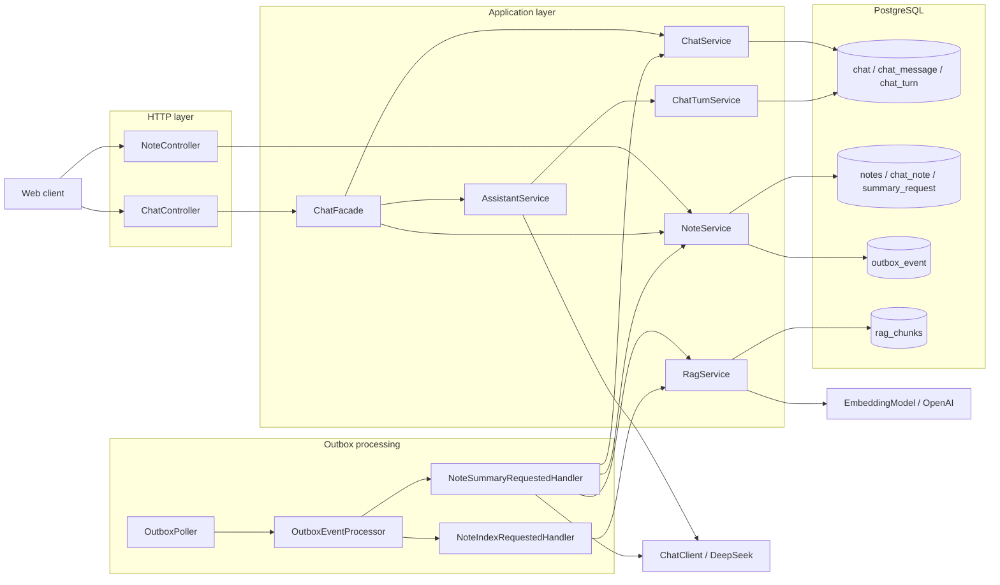
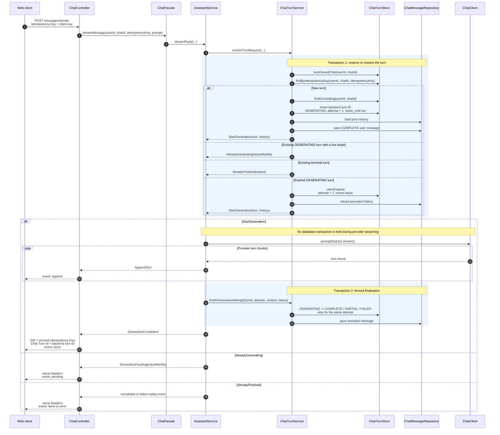
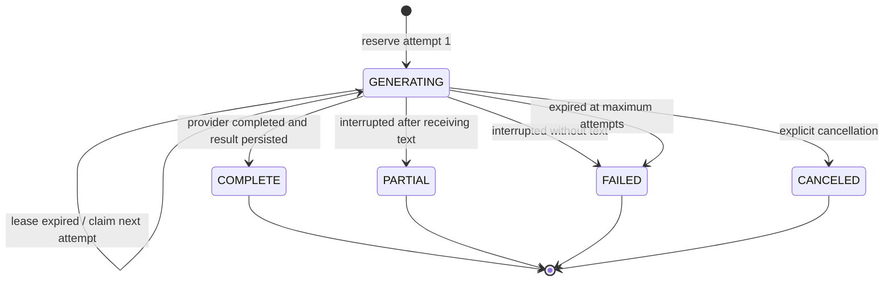
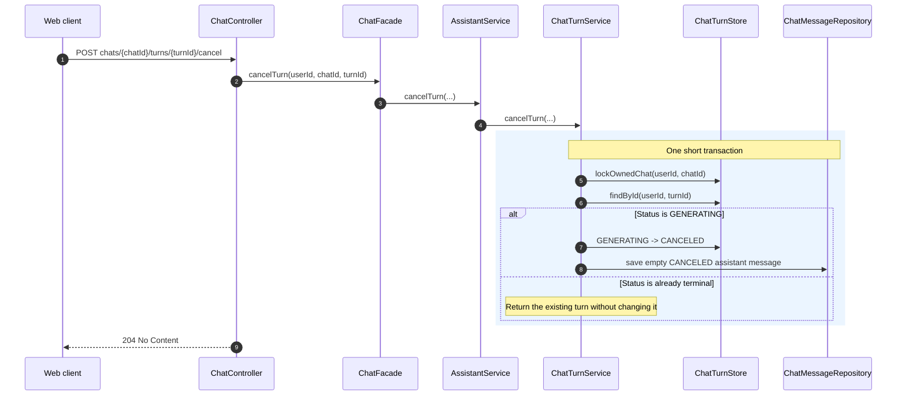
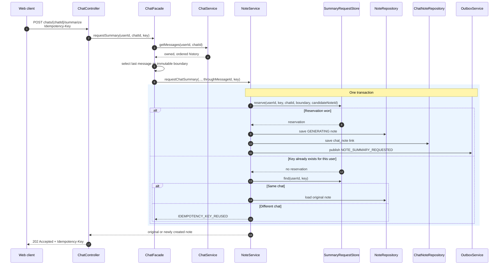
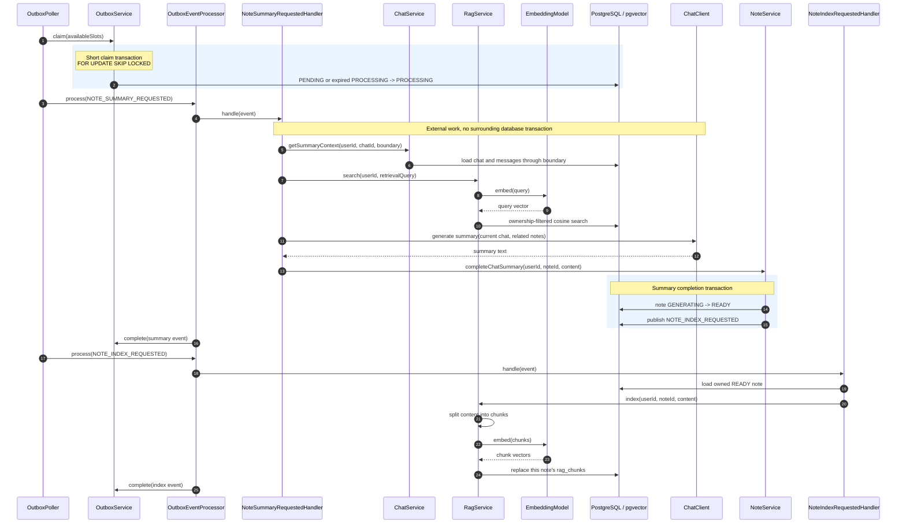
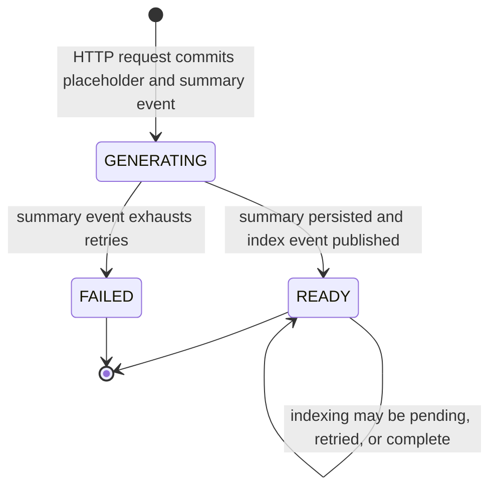
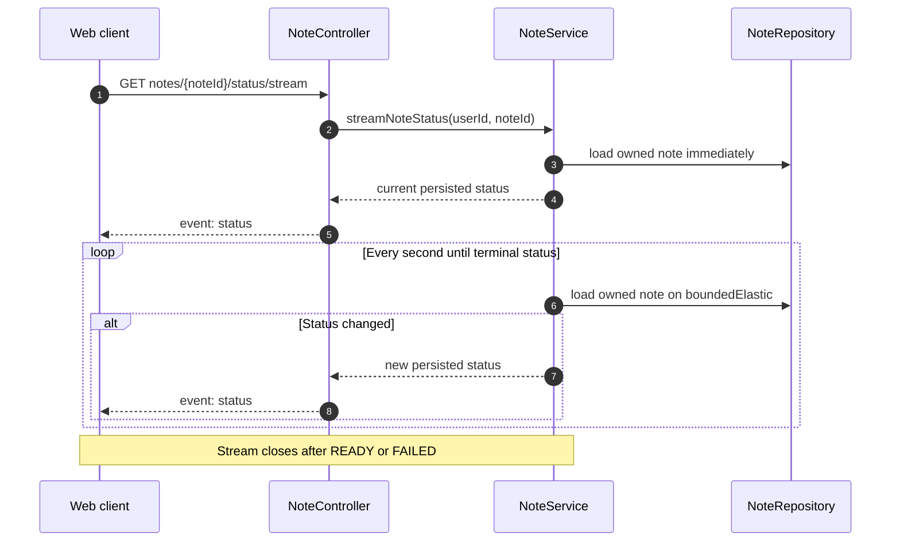

# Note service request flows

This document describes the current request paths in `:note`. It focuses on call order,
transaction boundaries, durable state, and external AI calls. All controller routes below receive
the `/note` prefix from `WebMvcPathPrefixConfig`.

## Component map

The controllers map authentication and transport data. `ChatFacade` coordinates use cases that
span chat, assistant, and note services. Repositories and JDBC stores are reached only from the
application services or outbox handlers.

## Endpoint routing

| Request                                           | Synchronous call path                                                 | Result                                             |
|---------------------------------------------------|-----------------------------------------------------------------------|----------------------------------------------------|
| `POST /note/chats`                                | `ChatController -> ChatFacade -> ChatService`                         | Creates an owned chat                              |
| `GET /note/chats`                                 | `ChatController -> ChatFacade -> ChatService`                         | Lists the user's chats                             |
| `GET /note/chats/{chatId}/messages`               | `ChatController -> ChatFacade -> ChatService`                         | Returns ownership-filtered history                 |
| `POST /note/chats/{chatId}/messages/stream`       | `ChatController -> ChatFacade -> AssistantService -> ChatTurnService` | Reserves or replays a turn, then returns SSE       |
| `POST /note/chats/{chatId}/turns/{turnId}/cancel` | `ChatController -> ChatFacade -> AssistantService -> ChatTurnService` | Cancels an active turn                             |
| `POST /note/chats/{chatId}/summarize`             | `ChatController -> ChatFacade -> ChatService + NoteService`           | Creates or replays an asynchronous summary request |
| `GET /note/notes`                                 | `NoteController -> NoteService`                                       | Lists the user's notes                             |
| `GET /note/notes/{noteId}`                        | `NoteController -> NoteService`                                       | Returns an ownership-filtered note                 |
| `GET /note/notes/{noteId}/status/stream`          | `NoteController -> NoteService`                                       | Streams persisted note status changes              |

## Streamed chat turn

The client generates an `Idempotency-Key` for one logical send and retains it while that operation
is unresolved. PostgreSQL scopes this key to the chat. The backend separately generates the
`chat_turn.id`, returns it in `Chat-Turn-Id`, and stores it on the turn's USER and ASSISTANT
messages. The server also calculates a SHA-256 request fingerprint from the fingerprint format
version and the exact UTF-8 prompt bytes. The fingerprint prevents the same client key from being
reused for different input in the same chat.

Important behavior:

- The owned chat row is locked only while reserving or resolving a turn. The lock is released before
  the provider call.
- Only one `GENERATING` turn is allowed per chat. A different idempotency key while one is active
  produces `CHAT_TURN_ACTIVE`.
- Reusing an idempotency key with different prompt content in the same chat produces
  `IDEMPOTENCY_KEY_REUSED`. The same key in another chat is an independent operation.
- A live lease returns `pending`; an expired lease may be reclaimed with a higher attempt number.
- Finalization is fenced by `turnId + userId + chatId + attempt + GENERATING`. A late provider result
  cannot overwrite a cancellation or the result of a newer attempt.
- A completed replay emits the terminal event but does not replay old text chunks. The client
  reconciles the durable assistant message from chat history.
- The SPA uses `Chat-Turn-Id` for history reconciliation and cancellation. It uses the client key
  only to retry the same unresolved send.
- Provider completion becomes `COMPLETE`. An interruption after some text becomes `PARTIAL`; an
  interruption before any text becomes `FAILED`.

### Chat turn states

## Explicit chat-turn cancellation

The cancellation changes durable state; it does not directly terminate the provider's network
request. Attempt fencing prevents a provider result that arrives later from changing the canceled
turn.

## Asynchronous chat summary request

The summary `Idempotency-Key` is scoped by `userId`. The request thread does not call a model.

The reservation, placeholder note, `chat_note` link, and outbox event commit atomically. If any
write fails, the reservation also rolls back and the same key can be retried. Concurrent requests
with the same `(userId, Idempotency-Key)` converge on the winning transaction's `noteId`.

## Summary generation and indexing workers

The outbox separates durable database changes from slow provider work. Claim, provider work, and
completion/failure bookkeeping do not share one transaction.

On a handler error, `OutboxEventProcessor` calls `OutboxService.recordFailure` in a new short
transaction. The event returns to `PENDING` with exponential backoff until the configured attempt
limit. When a `NOTE_SUMMARY_REQUESTED` event reaches the limit, that same transaction marks the
outbox event and its still-`GENERATING` note as `FAILED`. A crashed worker leaves a `PROCESSING`
event reclaimable after its visibility deadline.

### Note states

`READY` means the note content is available. It does not mean indexing has already completed.

## Note status stream

Missing and foreign note or chat identifiers both appear as `404`, so ownership information is not
leaked.

## Transaction boundary summary

| Use case             | Transactional work                                                | Work outside that transaction                                |
|----------------------|-------------------------------------------------------------------|--------------------------------------------------------------|
| New chat turn        | Lock chat, reserve turn, persist user message                     | Provider stream                                              |
| Finish chat turn     | Fence the attempt, persist terminal turn and assistant message    | SSE delivery                                                 |
| Cancel chat turn     | Lock chat, mark turn canceled, persist canceled assistant message | Provider request may finish later and is rejected by fencing |
| Request summary      | Reserve key, create note/link, publish summary event              | Summary generation                                           |
| Process outbox event | Claim, complete, or record failure each use a short transaction   | Handler, chat model, embedding model                         |
| Complete summary     | Persist content as `READY`, publish index event                   | Later indexing handler                                       |
